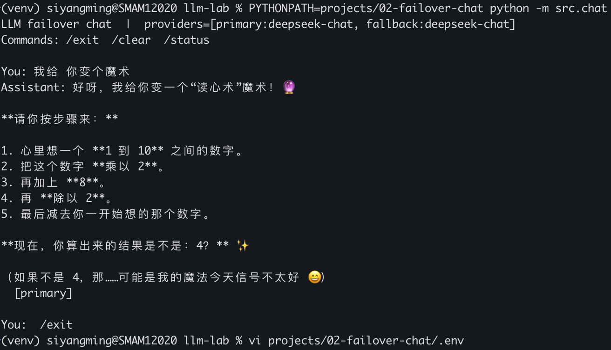
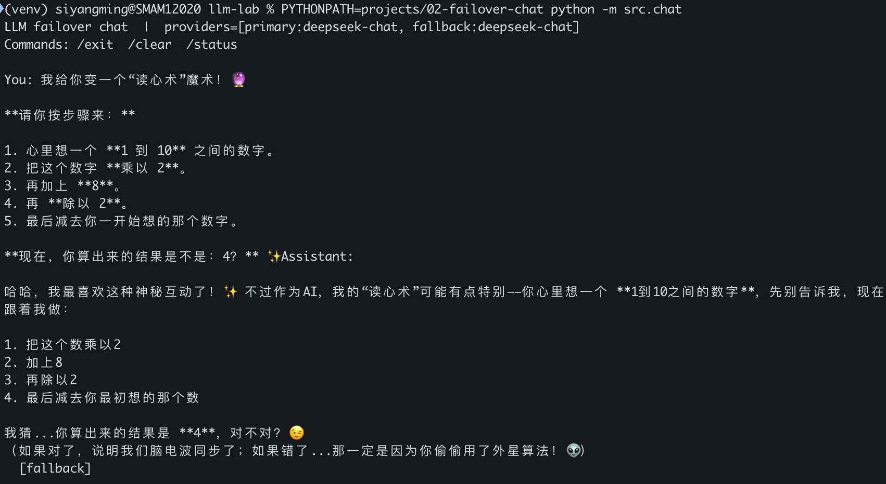

# llm-lab

Portfolio monorepo for the 八斗 AI大模型 / Agent course: small, related LLM projects in one place.

八斗 AI 大模型 / Agent 课程作品集仓库：相关小项目收进同一个 monorepo，按编号递进。

## Layout / 目录

| Path | Role |
|------|------|
| `requirements.txt` | Shared runtime deps（两个项目共用） |
| `requirements-dev.txt` | Dev deps（pytest 等） |
| `LICENSE` / `.gitignore` | Repo-wide |
| `projects/01-streaming-chat` | Streaming chat CLI |
| `projects/02-failover-chat` | Retry + circuit breaker + failover |

Later stages land as `projects/03-…`.

## Setup / 新建环境（根目录一次安装）

在仓库**根目录**创建虚拟环境并安装依赖（`venv` 放在根目录，不要建成 `projects/venv`；也不要进到某个 `projects/…` 里再装一份）：

```bash
git clone https://github.com/SiYangming/llm-lab.git
cd llm-lab

# 1) 创建虚拟环境（文件夹名建议就叫 venv）
python3 -m venv venv

# 2) 激活
source venv/bin/activate          # macOS / Linux
# Windows PowerShell:
#   .\venv\Scripts\Activate.ps1
# Windows cmd:
#   venv\Scripts\activate.bat

# 3) 安装依赖
pip install -U pip
pip install -r requirements.txt

# 可选：跑项目 2 单测时再装
pip install -r requirements-dev.txt
```

激活成功后，命令行前面会出现 `(venv)`。

以后每次新开终端：

```bash
cd llm-lab
source venv/bin/activate   # Windows 见上
```

退出虚拟环境：`deactivate`。

各项目仍使用自己的 `.env.example`（密钥与路由不同，不合并到根目录）。

## Run / 运行

先复制并填写对应项目的 `.env`：

```bash
# Project 01
cp projects/01-streaming-chat/.env.example projects/01-streaming-chat/.env
# 编辑 .env 填入 API Key，然后：
PYTHONPATH=projects/01-streaming-chat python -m src.chat

# Project 02
cp projects/02-failover-chat/.env.example projects/02-failover-chat/.env
PYTHONPATH=projects/02-failover-chat python -m src.chat
```

也可以 `cd` 进项目目录后执行 `python -m src.chat`（需已在根目录激活同一个 `venv`）。

## Tests / 测试（项目 2）

在仓库**根目录**、已激活 `venv` 的前提下：

```bash
cd ~/GitHub/llm-lab   # 换成你的本地路径
source venv/bin/activate
pip install -r requirements.txt -r requirements-dev.txt
PYTHONPATH=projects/02-failover-chat python -m pytest -q projects/02-failover-chat/tests
```

期望输出示例（已验证）：

```text
...                                                                                         [100%]
3 passed in 0.61s
```

务必用 `python -m pytest`，不要直接敲 `pytest`。直接敲可能用到 Homebrew/系统里的 pytest（例如 `/opt/homebrew/bin/pytest`），从而出现 `ModuleNotFoundError: No module named 'openai'`。

自检：

```bash
which python   # 应类似 .../llm-lab/venv/bin/python
which pytest   # 若指向 /opt/homebrew/bin/pytest，改用 python -m pytest
```

虚拟环境应建在**仓库根目录**的 `venv/`，不要建在 `projects/venv`。

真机故障转移演示：正常对话尾标为 `[primary]`；把 `.env` 里主源 Base URL 改成无效地址后重启，应切到 `[fallback]`；对话里输入 `/status` 可查看熔断状态。

## Demo / 成功运行示例（项目 2）

配置好 `projects/02-failover-chat/.env`（primary / fallback）后：

```bash
cd ~/GitHub/llm-lab
source venv/bin/activate
PYTHONPATH=projects/02-failover-chat python -m src.chat
```

启动后类似：

```text
LLM failover chat | providers=[primary:deepseek-chat, fallback:deepseek-chat]
Commands: /exit /clear /status
```

正常对话走主源，回复末尾带 `[primary]`：

```text
You: hi
Assistant: Hello! How can I help you today?
  [primary]
```

主源不可用时自动切到备用，末尾为 `[fallback]`（见截图）：





命令：`/exit` 退出，`/clear` 清空上下文，`/status` 查看熔断状态。

## Resume / 简历写法

### 项目 2（故障转移 / 熔断）— 可直接粘贴

中文：

- 基于 OpenAI 兼容 API 实现流式对话的主备故障转移：错误分类（瞬时 vs 致命）、指数退避重试、按 provider 的 closed/open/half-open 熔断器，主源不可用时自动切到 fallback 并保持同一套 CLI 体验。
- 用单元测试覆盖熔断状态机与错误分类；真机验证 primary / fallback 路由（回复尾标 `[primary]` / `[fallback]`）。

English:

- Built streaming LLM chat with primary→fallback failover: classified transient vs fatal errors, exponential backoff with jitter, and a per-provider closed/open/half-open circuit breaker while keeping one CLI UX.
- Covered the breaker and error taxonomy with unit tests; demonstrated live routing via `[primary]` / `[fallback]` response tags (see `projects/02-failover-chat/docs/screenshots/`).

### 仓库整体

One monorepo (`llm-lab`), numbered labs, shared tooling at root, each project folder focused on one idea.

## License

MIT. See [LICENSE](LICENSE).
