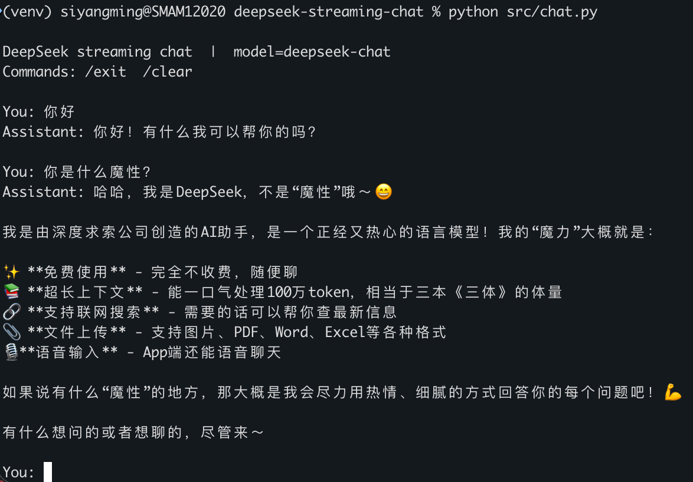

> Part of the [llm-lab](https://github.com/SiYangming/llm-lab) monorepo (八斗 AI course).
>
> 本目录属于 monorepo [llm-lab](https://github.com/SiYangming/llm-lab)。共享依赖在仓库根目录的 `requirements.txt` / `LICENSE` / `.gitignore`。

# deepseek-streaming-chat

Portfolio CLI for multi-turn streaming chat with [DeepSeek](https://api-docs.deepseek.com/) through its OpenAI-compatible API. Course project: 八斗 AI Project 1.

面向简历演示的命令行多轮流式对话。通过 DeepSeek 的 OpenAI 兼容接口调用 `deepseek-chat`。课程项目：八斗 AI Project 1。

## Purpose / 项目目的

Show a small, readable client that streams tokens as they arrive, keeps conversation history, and never hardcodes secrets.

用尽量少的代码演示：边生成边打印、多轮上下文、密钥只放在环境变量里。

## Demo / 演示

本地 venv 实测截图（`python src/chat.py`，模型 `deepseek-chat`）：



```text
$ python src/chat.py
DeepSeek streaming chat  |  model=deepseek-chat
Commands: /exit  /clear

You: 用一句话解释流式输出
Assistant: 流式输出是模型每生成一小段文本就立刻发给客户端，而不是等整段回答结束。

You: /clear
Conversation cleared.

You: /exit
```

## Setup / 本地环境（推荐用 venv）

建议在本地新建虚拟环境再跑，依赖干净、可复现，也方便拍终端截图放进简历仓库。不必使用 Docker。

```bash
git clone https://github.com/SiYangming/llm-lab.git
cd llm-lab/projects/01-streaming-chat
python3 -m venv venv
source venv/bin/activate          # Windows: venv\Scripts\activate
pip install -r ../../requirements.txt  # from this folder; or install once at repo root
cp .env.example .env
```

Edit `.env` and set `DEEPSEEK_API_KEY`. Get a key from the [DeepSeek platform](https://platform.deepseek.com/). Do not commit `.env`（已在 `.gitignore` 中忽略）。

在 `.env` 中填写 `DEEPSEEK_API_KEY`。密钥从 [DeepSeek 开放平台](https://platform.deepseek.com/) 申请。不要把 `.env` 提交到仓库。

Optional / 可选环境变量：

| Variable | Default |
| --- | --- |
| `DEEPSEEK_BASE_URL` | `https://api.deepseek.com` |
| `DEEPSEEK_MODEL` | `deepseek-chat` |

## Run / 运行

```bash
source venv/bin/activate
python src/chat.py
```

Commands: `/exit` (or `/quit`) leaves the session; `/clear` drops conversation history.

## Screenshots / 截图流程

本地 venv 跑通后，为 README / 简历准备截图：

1. 激活环境并启动：`source venv/bin/activate && python src/chat.py`
2. 输入 1～2 轮问题，确认回复是逐字/逐段刷出（流式）
3. 可再试一次 `/clear`，体现多轮与清空
4. 截取终端窗口，保存到仓库：

```bash
mkdir -p docs/screenshots
# 将截图保存为例如：
#   docs/screenshots/streaming.png   # 流式输出过程
#   docs/screenshots/clear.png       # /clear 后新开一轮
```

5. 在本 README 的 Demo 区下方用 Markdown 引用（拍好后取消注释或改成真实路径）：

```markdown


```

6. 提交截图时只提交图片文件，确认没有把 `.env` 或密钥拍进画面里。

## Architecture / 架构

`src/chat.py` loads the API key with `python-dotenv`, opens an OpenAI client pointed at DeepSeek, calls `chat.completions.create(..., stream=True)`, and prints `delta.content` with `flush=True` as chunks arrive. `/clear` resets history; `/exit` quits.

## Resume bullet points / 简历要点

- Built a multi-turn streaming chat CLI on DeepSeek's OpenAI-compatible API (`stream=True`, incremental token flush).
- Kept credentials out of source with `.env` / `.env.example`; local demo uses an isolated `venv`.

## License / 许可

MIT. See [LICENSE](LICENSE).
